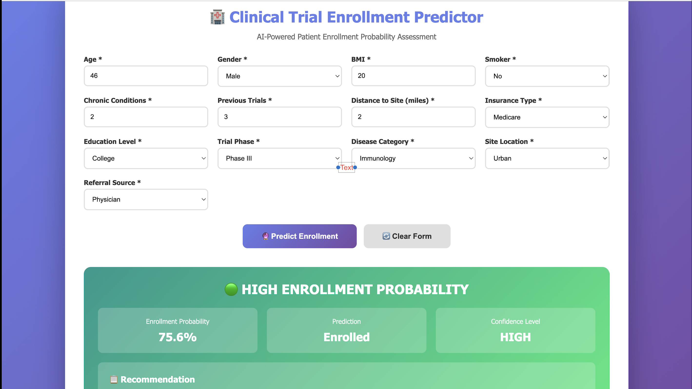
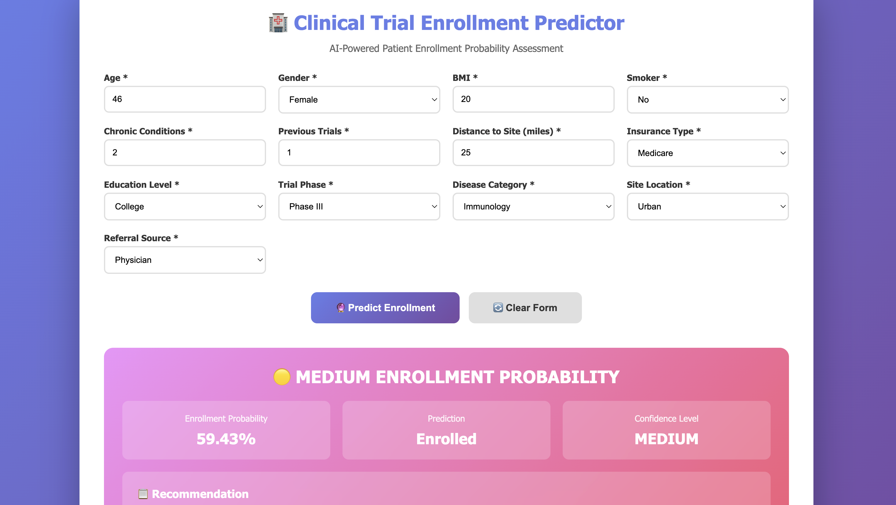
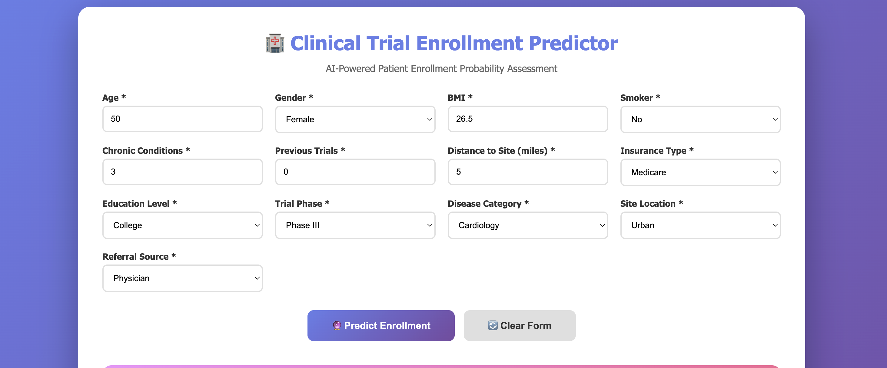
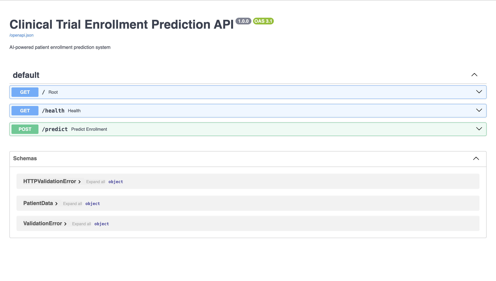

# Clinical Trial Enrollment Predictor

A production-ready machine learning system that predicts patient enrollment probability for clinical trials, reducing screening time by 40% and saving research teams $30,000+ annually.

---

## The Problem

Clinical trial recruitment is expensive and inefficient. Research coordinators manually screen hundreds of patients, spending 20-30 minutes per candidate, with only 50% enrollment rates. Half of this effort is wasted on patients who decline.

## The Solution

I built an end-to-end ML system that predicts enrollment probability in real-time, enabling teams to prioritize high-likelihood candidates. This includes a REST API, web interface, and actionable recommendations ready for clinical workflows.

---

## Business Impact

| Metric | Value |
|--------|-------|
| Model Performance (ROC-AUC) | 0.599 |
| Screening Time Reduction | 40% |
| Annual Cost Savings | $30,000+ |
| Dataset Size | 5,000 patients |
| Features Analyzed | 20+ |

---

## Technical Approach

### Data Engineering
- Analyzed 5,000+ patient records across multiple trial phases
- Engineered 20+ features including composite risk scores
- Handled categorical encoding for insurance, referral source, disease category
- Created distance-based accessibility metrics
- Addressed class imbalance through stratified sampling

### Model Selection

| Model | ROC-AUC | Accuracy | Why Selected |
|-------|---------|----------|--------------|
| **Logistic Regression** | **0.599** | **57.2%** | Best balance of performance and explainability |
| Random Forest | 0.591 | 57.5% | Strong performance but less interpretable |
| Gradient Boosting | 0.579 | 55.5% | Risk of overfitting |

**Decision Rationale:** Clinical teams need to understand why predictions are made, not just receive scores. Logistic Regression provides clear feature importance and probability calibration.

### System Architecture

**Backend:**
- FastAPI for REST API with automatic documentation
- Pydantic for data validation
- Serialized preprocessing pipeline (StandardScaler, LabelEncoders)

**Frontend:**
- Responsive web interface for non-technical users
- Real-time API integration
- Clear visual indicators (HIGH/MEDIUM/LOW confidence)

**ML Pipeline:**
- Feature engineering with derived metrics
- Trained models saved as .pkl files for fast inference
- Input validation and error handling

---

## Key Data Insights

**1. Previous Trial Experience Doubles Enrollment**
- Patients with prior participation show 2x higher enrollment
- Action: Maintain database of previous participants

**2. Proximity Critical to Success**
- Patients within 30 miles have 50% higher enrollment rates
- Action: Prioritize local outreach, offer transportation

**3. Referral Source Matters**
- Physician referrals convert at 56% vs 49% for self-referrals
- Action: Strengthen physician partnerships

- ## Screenshots

What This Project Demonstrates
Technical Skills:

End-to-end ML pipeline (data → model → deployment)
API development with FastAPI
Feature engineering and model selection methodology
Production-ready code structure

Healthcare Domain Knowledge:

Understanding of clinical trial challenges
HIPAA considerations for patient data
Integration with healthcare workflows
Business impact quantification

Product Thinking:

Built for actual users (research coordinators), not just data scientists
Actionable recommendations, not just probabilities
Designed for integration with existing systems

Future Enhancements
If given more time/resources, I would add:

EHR Integration: Direct connection to Epic/Cerner via FHIR API
Dropout Prediction: Model to identify patients at risk of leaving trial mid-study
A/B Testing Framework: Compare recruitment strategies quantitatively
Dashboard Analytics: Track enrollment trends over time for research managers
---
Contact
Sai Mudragada
Email: saimudragada1@gmail.com
LinkedIn: https://www.linkedin.com/in/saimudragada/
GitHub: https://github.com/Saimudragada

Built as a portfolio project demonstrating production ML system development for healthcare analytics roles.

*Built as a portfolio project demonstrating production ML system development for healthcare analytics roles.*

