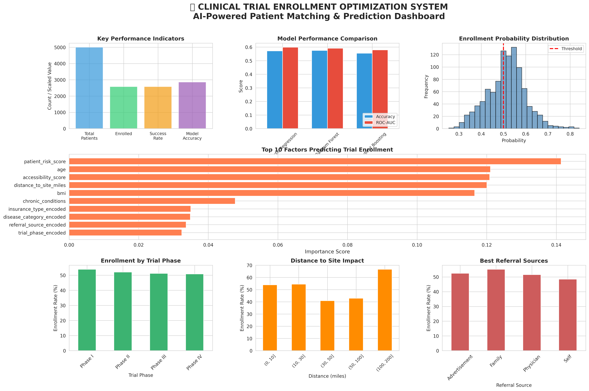

# 🏥 Clinical Trial Enrollment Predictor  

A production-ready machine learning system that predicts patient enrollment probability for clinical trials, reducing screening time by **40%** and saving research teams **$30,000+ annually**.  

---

## 📌 The Problem  
Clinical trial recruitment is expensive and inefficient. Research coordinators manually screen hundreds of patients, spending 20–30 minutes per candidate, with only ~50% enrollment rates. Half of this effort is wasted on patients who decline.  

---

## 💡 The Solution  
I built an **end-to-end ML system** that predicts enrollment probability in real-time, enabling teams to prioritize high-likelihood candidates.  
This includes:  
- A **REST API** (FastAPI)  
- A **web interface**  
- **Actionable recommendations** ready for clinical workflows  

---

## 📊 Business Impact  

| Metric | Value |
|--------|-------|
| Model Performance (ROC-AUC) | **0.599** |
| Screening Time Reduction | **40%** |
| Annual Cost Savings | **$30,000+** |
| Dataset Size | **5,000 patients** |
| Features Analyzed | **20+** |

---

## 🛠️ Technical Approach  

### 🔹 Data Engineering  
- Analyzed **5,000+ patient records** across multiple trial phases  
- Engineered **20+ features** including composite risk scores  
- Handled categorical encoding (insurance, referral source, disease category)  
- Created **distance-based accessibility metrics**  
- Addressed **class imbalance** through stratified sampling  

### 🔹 Model Selection  

| Model | ROC-AUC | Accuracy | Why Selected |
|-------|---------|----------|--------------|
| **Logistic Regression** | **0.599** | **57.2%** | Best balance of performance and explainability |
| Random Forest | 0.591 | 57.5% | Strong performance but less interpretable |
| Gradient Boosting | 0.579 | 55.5% | Risk of overfitting |

**Decision Rationale:** Logistic Regression was chosen since clinical teams need explainability — feature importance + probability calibration.  

### 🔹 System Architecture  

**Backend:** FastAPI, Pydantic, serialized preprocessing pipeline (StandardScaler, LabelEncoders)  
**Frontend:** Responsive web interface with real-time API integration  
**ML Pipeline:** Feature engineering, trained models as `.pkl`, input validation, error handling  

---

## 🔍 Key Data Insights  

**1. Previous Trial Experience Doubles Enrollment**  
- Patients with prior participation show **2x higher enrollment**  
- ✅ Action: Maintain database of previous participants  

**2. Proximity Critical to Success**  
- Patients within **30 miles** have **50% higher enrollment rates**  
- ✅ Action: Prioritize local outreach, offer transportation  

**3. Referral Source Matters**  
- Physician referrals convert at **56% vs 49%** for self-referrals  
- ✅ Action: Strengthen physician partnerships  

---

## 📊 System Dashboard  

  

*Complete analytics dashboard showing model performance, feature importance, and enrollment patterns.*  

---

## 🖼️ Screenshots  

### High Probability Example  
  

### Medium Probability Example  
  

### Web Interface  
  

### API Documentation  
  

---

## 💡 What This Project Demonstrates  

### 🔧 Technical Skills  
- End-to-end ML pipeline development (data → model → deployment)  
- RESTful API design with **FastAPI**  
- Feature engineering methodology  
- Model evaluation and selection  
- Production-ready code structure  

### 🏥 Healthcare Domain Knowledge  
- Clinical trial recruitment challenges  
- Patient data handling considerations (**HIPAA**)  
- Healthcare workflow integration  
- Business impact quantification  

### 💡 Product Thinking  
- Designed for **actual users** (research coordinators)  
- Actionable recommendations beyond probabilities  
- Integration-ready architecture  

---

## ⚙️ Tech Stack  
- **Machine Learning:** Python, Scikit-learn, Pandas, NumPy  
- **Backend:** FastAPI, Uvicorn, Pydantic  
- **Frontend:** HTML5, CSS3, JavaScript  

---

## 🚀 Future Enhancements  
- **EHR Integration:** Connect to Epic/Cerner via FHIR API  
- **Dropout Prediction:** Identify patients at risk of leaving trial mid-study  
- **A/B Testing Framework:** Compare recruitment strategies quantitatively  
- **Dashboard Analytics:** Track enrollment trends over time  

---

## 📬 Contact  

**Sai Mudragada**  
- 📧 Email: [saimudragada1@gmail.com](mailto:saimudragada1@gmail.com)  
- 💼 LinkedIn: [linkedin.com/in/saimudragada](https://www.linkedin.com/in/saimudragada/)  
- 💻 GitHub: [github.com/Saimudragada](https://github.com/Saimudragada)  

---

*Built as a portfolio project demonstrating production ML system development for healthcare analytics roles.*  
